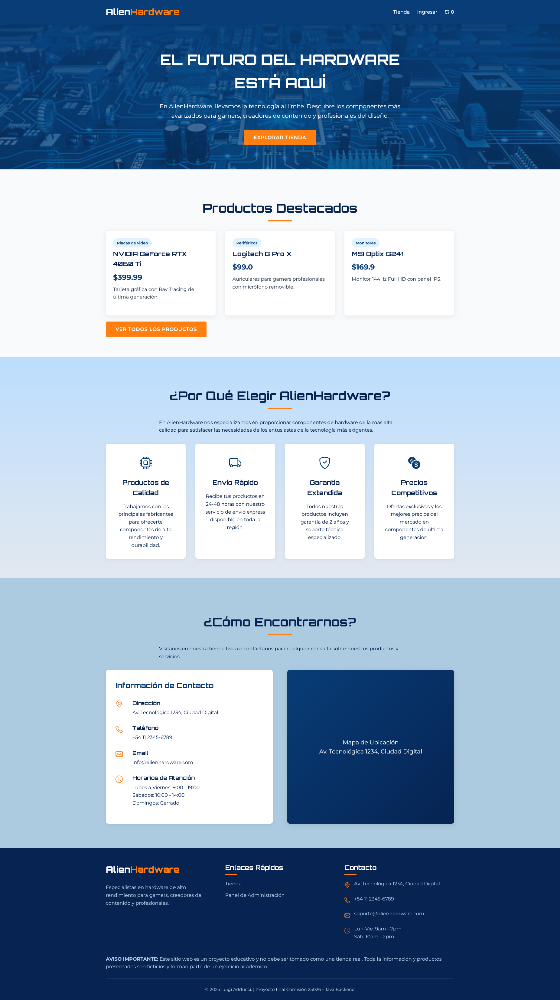
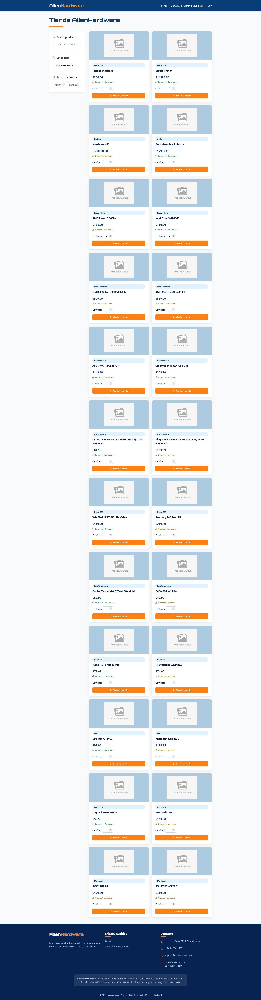
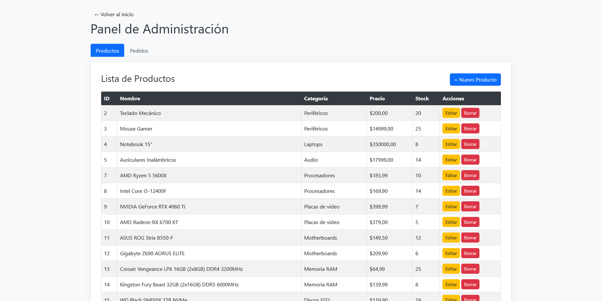

# Entrega final Java 25026 - Luigi Adducci - Tienda de Hardware (AlienHardware)

Proyecto final de crear API RESTful completa en Java utilizando Spring Boot y MySQL para gestionar un sistema de E-commerce, integrándose con una aplicación frontend.

## Stack usado en el proyecto

Como lenguaje principal de back use Java + librerias de java (SpringBoot). Despues para el manejo de base de datos y servidor se uso TomCat, MySql y Apache.
Por ultimo del lado del front use tanto Html pleno para toda las vistas en si con Boostrap + icons y Googlefont 

## Screenshots de la tienda

